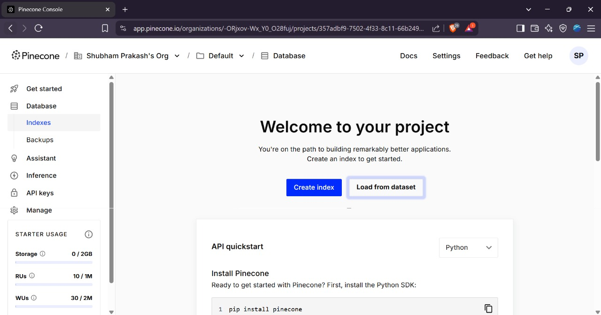
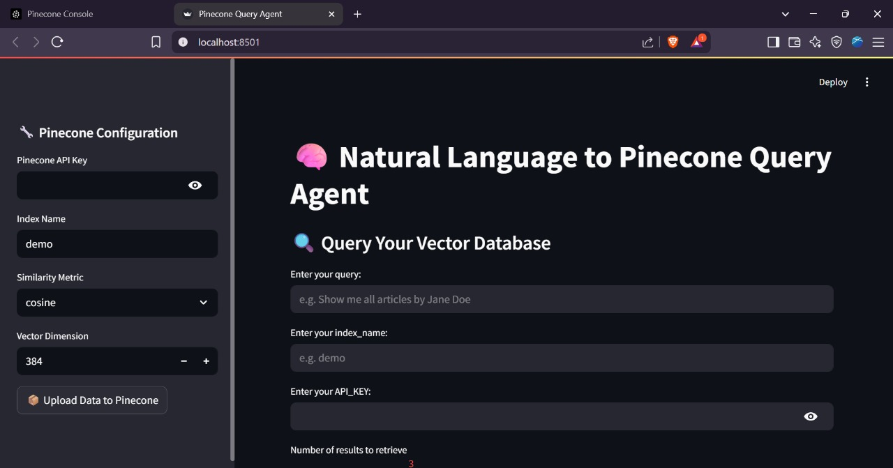
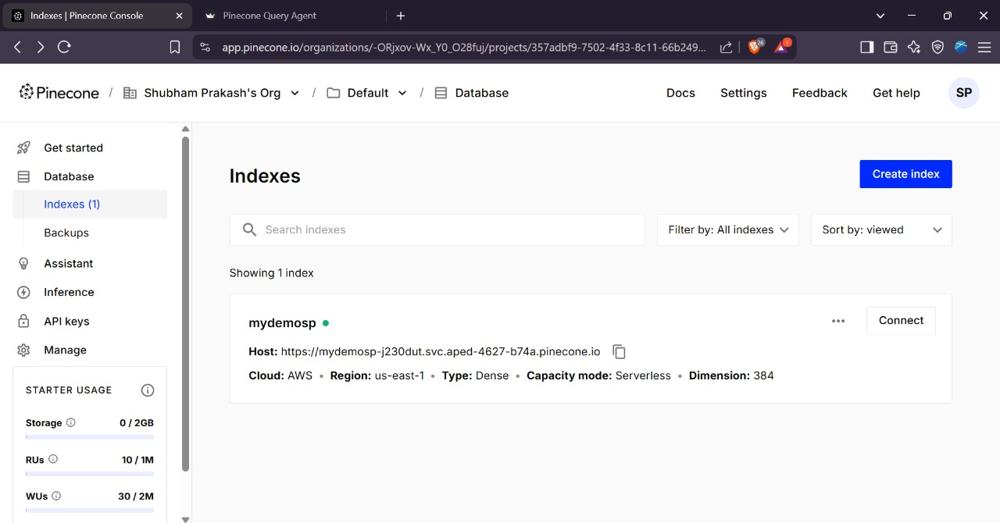
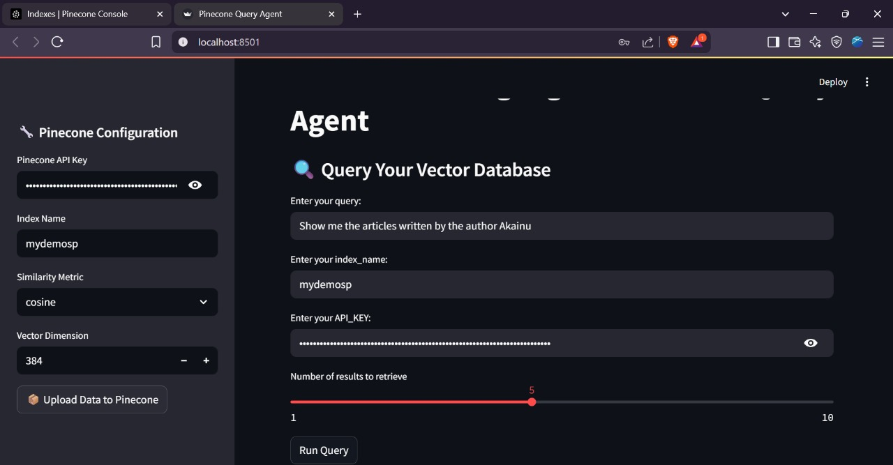
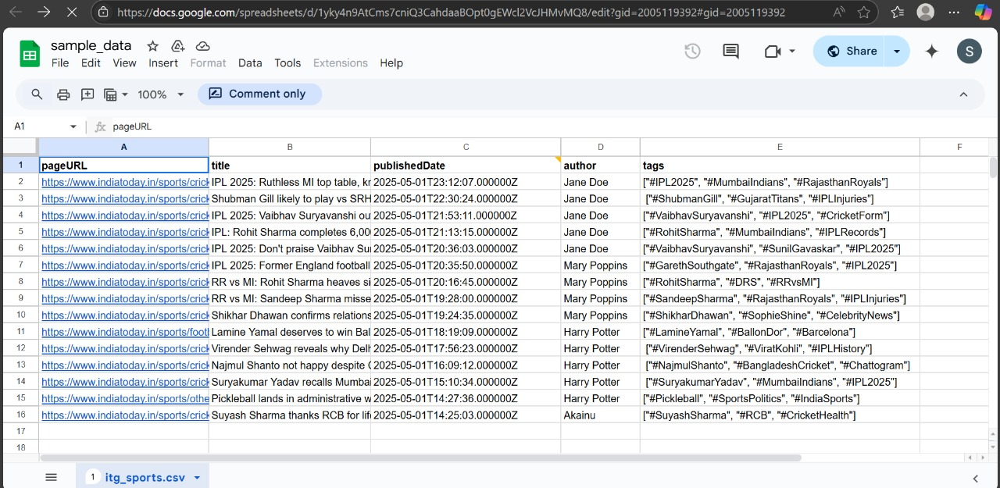
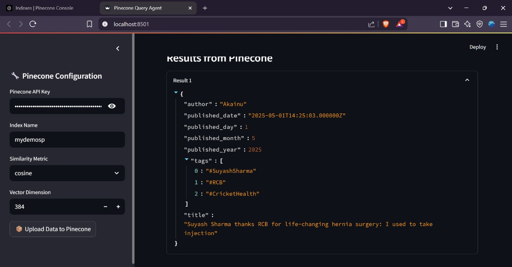

# 🧠 Natural Language to Pinecone Query Agent

A Streamlit application that converts natural language queries into precise Pinecone vector database searches, combining semantic search with metadata filtering.

## 📸 Application Screenshots

### System Architecture

*Complete system architecture showing data flow from CSV input to query results*

### Pinecone Console Setup

*Initial Pinecone console showing empty project ready for index creation*

### Application Interface

*Main application interface with configuration panel and query section*

### Data Upload Process

*CSV data being processed and uploaded to Pinecone vector database*

### Query Processing

*Natural language query being processed and results being displayed*

### Sample Data Structure

*Example CSV data structure with required columns and format*

### Query Results

*Search results showing matched articles with complete metadata*

## 🚀 What This Project Does

Transforms natural language queries into sophisticated vector database searches by:

1. **Natural Language Processing**: Takes plain English questions and understands intent
2. **Dual Query Generation**: Creates semantic embeddings and metadata filters
3. **Intelligent Filtering**: Extracts filters for authors, dates, and tags
4. **Vector Search**: Performs similarity searches using sentence transformers
5. **Results Display**: Presents matching results with metadata

## 🎯 Key Features

### Smart Query Interpretation
- **Semantic Understanding**: Extracts core topics for vector similarity search
- **Metadata Filtering**: Identifies and applies filters for authors, dates, tags
- **Flexible Date Parsing**: Understands "last year", "June 2023", "this month"

### AI Integration
- **Google Gemini Integration**: Uses Gemini 2.5 Flash for query parsing
- **Sentence Transformers**: Employs 'all-MiniLM-L6-v2' for text embeddings
- **Pinecone Vector DB**: Serverless vector database for fast, scalable search

### User Interface
- **Streamlit Web App**: Clean, intuitive interface
- **Real-time Results**: Instant query processing and display
- **Configurable Parameters**: Adjust search parameters like top-k results
- **Data Upload**: Simple CSV to vector database pipeline

## 🔍 How It Works

### 1. Data Processing Pipeline
```
CSV Data → JSON Conversion → Embedding Generation → Pinecone Format → Vector Database
```

The system processes CSV data through stages:
- Converts CSV to structured JSON format
- Generates title embeddings using sentence transformers
- Formats data for Pinecone with metadata structure
- Uploads vectors to Pinecone index

### 2. Query Processing
When you ask: *"Show me articles by Jane Doe from last year about machine learning"*

The system:
- **Extracts Metadata Filter**: `{"author": "Jane Doe", "published_year": 2024, "tags": {"$in": ["machine learning"]}}`
- **Creates Semantic Query**: `"machine learning articles"`
- **Generates Embedding**: Converts semantic query to vector representation
- **Searches Database**: Combines vector similarity with metadata filtering
- **Returns Results**: Displays matched articles with metadata

### 3. Supported Query Types

**Author-based**: "Find articles by John Smith"
**Date-based**: "Show me posts from last year"
**Topic-based**: "Find content about vector databases"
**Combined**: "Alice's articles about NLP from 2024"

## 🏗️ System Architecture

Architecture with clear separation of concerns:

**Data Processing Layer**: CSV ingestion, JSON transformation, embedding generation
**AI Processing Layer**: Google Gemini for query interpretation, semantic extraction
**Interface Layer**: Streamlit application, real-time processing
**Storage Layer**: Pinecone vector database, local JSON files

### Core Components

**Frontend (app_sl.py)**: Streamlit interface, configuration panels, query input
**Backend (utils.py)**: Data processing, AI-powered query interpretation, vector operations

### Data Schema
CSV data requires:
- `pageURL`: Unique identifier
- `title`: Article/content title
- `publishedDate`: Publication date (ISO format)
- `author`: Author name
- `tags`: List of tags (string representation of Python list)

### Vector Database Structure
Each Pinecone record contains:
- **ID**: Unique identifier (pageURL)
- **Values**: 384-dimensional embedding vector
- **Metadata**: Title, author, publication date components, tags

## 🤖 AI Integration

### Google Gemini 2.5 Flash
- Converts natural language to Pinecone metadata filters
- Extracts semantic meaning for vector search
- Handles complex temporal and categorical queries

### Sentence Transformers
- Uses 'all-MiniLM-L6-v2' model for embeddings
- Generates 384-dimensional vectors
- Optimized for semantic similarity search

## 📊 Example Workflows

### Data Upload Workflow
1. Prepare CSV with required columns
2. Configure Pinecone settings (API key, index name, dimensions)
3. Click "Upload Data to Pinecone"
4. System processes and uploads data automatically

### Query Workflow
1. Enter natural language query
2. Provide Pinecone credentials
3. Set desired number of results
4. View interpreted query structure
5. Browse matched results with metadata

## 🔧 Technical Specifications

- **Vector Dimensions**: 384 (configurable)
- **Similarity Metrics**: Cosine, Euclidean, Dot Product
- **Cloud Provider**: AWS (configurable)
- **Region**: US-East-1 (configurable)
- **Embedding Model**: all-MiniLM-L6-v2
- **AI Model**: Google Gemini 2.5 Flash Preview

## 💡 Use Cases

- **Content Management**: Find specific articles in large databases
- **Research Discovery**: Locate papers by topic, author, or date
- **Knowledge Base Search**: Query organizational repositories
- **Blog/News Search**: Search article collections with natural language
- **Academic Research**: Find publications using conversational queries

## 🚀 Getting Started

### Prerequisites
- Python 3.8 or higher
- Pinecone account and API key
- Google AI API key (for Gemini integration)

### Installation

1. **Clone Repository**
   ```bash
   git clone https://github.com/ShubhamPrakash108/streamlit-based
   cd streamlit-based
   ```

2. **Create Virtual Environment**
   ```bash
   python -m venv venv
   
   # Windows:
   venv\Scripts\activate
   # macOS/Linux:
   source venv/bin/activate
   ```

3. **Install Dependencies**
   ```bash
   pip install -r requirements.txt
   ```

4. **Launch Application**
   ```bash
   streamlit run app_sl.py
   ```

### Setup Workflow

#### Step 1: Configure Pinecone
When the Streamlit app opens, configure:

- **Pinecone API Key**: Enter API key from [Pinecone Console](https://app.pinecone.io)
- **Index Name**: Choose name (e.g., "demo", "mydemosp")
- **Similarity Metric**: Select metric (cosine recommended)
- **Vector Dimension**: Keep as **384** (matches embedding model)

#### Step 2: Upload Data
1. Ensure CSV follows required schema:
   ```csv
   pageURL,title,publishedDate,author,tags
   https://example.com/article1,Sample Article,2025-05-01T14:25:03.000000Z,Akainu,"[""#SuyashSharma"", ""#RCB"", ""#CricketHealth""]"
   ```

2. Click **"📦 Upload Data to Pinecone"**

3. System processes data through stages:
   - Convert CSV to JSON format (`output.json`)
   - Generate embeddings (`encoded_output.json`)
   - Format for Pinecone (`pinecone_data.json`)
   - Upload to Pinecone index

#### Step 3: Query Database
1. **Enter query** in natural language:
   - "Show me articles written by the author Akainu"
   - "Find posts about cricket from last year"
   - "What did Jane Doe write about IPL?"

2. **Provide credentials**:
   - Enter **API Key** again
   - Enter **Index Name** again
   - Adjust **Number of results** (1-10)

3. **Run Query** and view results:
   - **Interpreted Query**: See conversion to filters and semantic search
   - **Results**: Browse matched articles with metadata

### Security Features
- **Double Authentication**: Enter API credentials twice for enhanced security
- **No Persistent Storage**: API keys not stored in application
- **Direct Index Access**: Queries go directly to your Pinecone index

### Sample Query Examples
Try these queries:
- "Show me articles written by the author Akainu"
- "Find cricket articles by Jane Doe from 2025"
- "What did Mary Poppins write about IPL?"
- "Show me recent articles about Vaibhav Suryavanshi"

### Troubleshooting
- **No Index Found**: Upload data first and verify index name matches
- **No Results**: Check query matches available data and authors
- **API Errors**: Verify Pinecone API key is valid with proper permissions
- **Dimension Mismatch**: Ensure vector dimension is set to 384

## 📈 Project Impact

This Natural Language to Pinecone Query Agent advances vector database accessibility for non-technical users. By combining large language models with efficient vector search, it creates an intuitive bridge between human language and sophisticated database queries.

### Key Achievements:
- **Simplified Vector Search**: Makes complex operations accessible through natural language
- **Intelligent Query Processing**: Automatically extracts semantic meaning and structured filters
- **Real-time Performance**: Delivers fast query results with immediate feedback
- **Scalable Architecture**: Built on cloud-native technologies for production deployment

The project showcases AI-powered interfaces' potential to democratize advanced database technologies, making them usable for content discovery, research, and knowledge management across domains.
